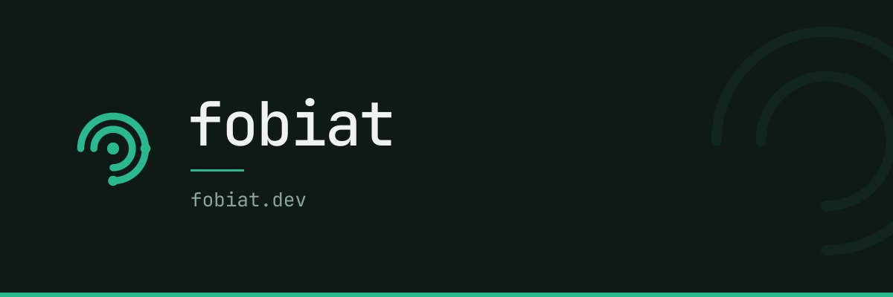

 *(trust me)*

# Kyle

I build the tools I couldn't find elsewhere: a self-hosted homelab to run
everything else on, an AI agent skill so coding agents stop guessing at an
unfamiliar game engine's API, workstation backups that are git commits
instead of disk images, and a couple of pieces of open hardware for vinyl DJing
because the commercial options didn't do what I wanted. Rust, real-time audio,
electronics, and C# game tooling, mostly. Long-form writeups live at
**[fobiat.dev](https://fobiat.dev)**.

| Project | What it is | Links |
| --- | --- | --- |
| **home-ops** | Single-node Kubernetes homelab. Talos Linux, Flux, SOPS+age, Tailscale-first. | [Repo](https://github.com/fobiat/home-ops) |
| **sbox-skill** | Teaches any coding agent to write s&box C# that actually compiles: 17 source-verified reference files plus an 18-tool MCP server for the editor. Stops agents writing Unity patterns into a Source 2 project. | [Repo](https://github.com/fobiat/sbox-skill) · [sbox.game](https://sbox.game/fobiat/sbox_mcp_server/) |
| **openBPM** | Tap-tempo BPM counter and beatmatch assistant for vinyl DJing on an ESP32: booth-legible digits, pitch %, and a drift timer. | [Repo](https://github.com/fobiat/openBPM) · [fobiat.dev/openbpm](https://fobiat.dev/openbpm) |
| **fobiat.dev** | This domain: an Astro landing page on Cloudflare Workers, mounting the project sites below it at their own paths. | [Repo](https://github.com/fobiat/fobiat.dev) |
| **Rivet** | Rebuild a workstation from a commit. Git-native environment snapshots for Linux and macOS, recording the packages and config you approve rather than a disk image. Private, close to release. | [fobiat.dev/rivet](https://fobiat.dev/rivet) · [Docs](https://fobiat.dev/rivet/docs/introduction/) |
| **cairn** | UK live incident service, honest about what it doesn't know. Private. | — |
| **Applejack** | A scarcity-driven city roleplay framework for [S&box](https://sbox.game), a ground-up reimagining of the Garry's Mod gamemode of the same name, rebuilt from scratch in C# on Source 2. Private, most active thing here day to day. | [fobiat.dev/applejack](https://fobiat.dev/applejack) · [Docs](https://fobiat.dev/applejack/docs/player/) |
| **openDVS** | An open-source Digital Vinyl System: a clean-room Rust timecode engine, a freely-pressable timecode vinyl format, and open hardware that doubles as a class-compliant USB audio interface. Private while the format settles. | — |
| **Ohmic Labs** | A modular handheld instrument platform: one ESP32 + OLED + encoder core hosting a menu of precision test instruments, starting with a PT100 RTD simulator and a 4-20 mA loop calibrator. Private. | — |
| **rivet-workstation** | An AI-first developer workstation: a YAML file becomes a reproducible, running project workspace, owned by a daemon, restorable onto a fresh machine via Rivet. Private, quietest of these right now. | [fobiat.dev/rivet-workstation](https://fobiat.dev/rivet-workstation) · [Docs](https://fobiat.dev/rivet-workstation/docs/plan/) |

---

[kyle@fobiat.dev](mailto:kyle@fobiat.dev) · [fobiat.dev/contact](https://fobiat.dev/contact)
